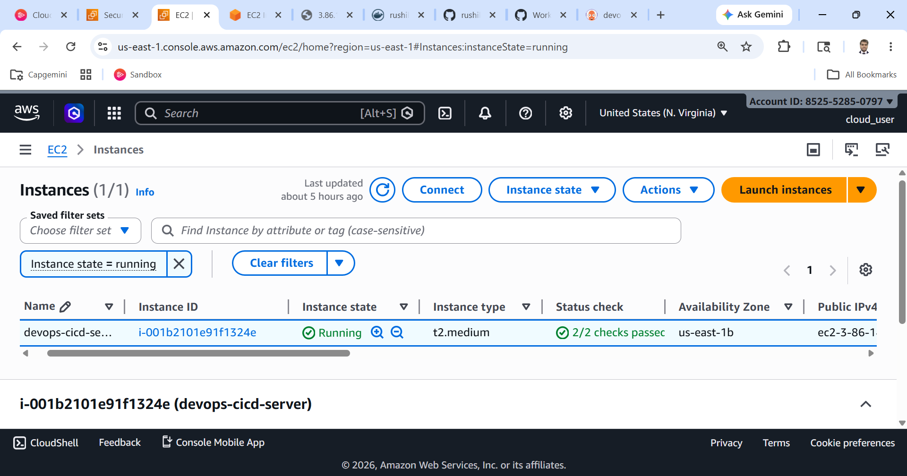
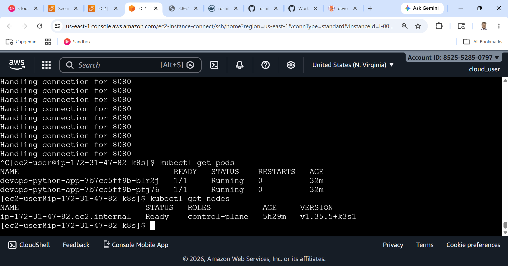
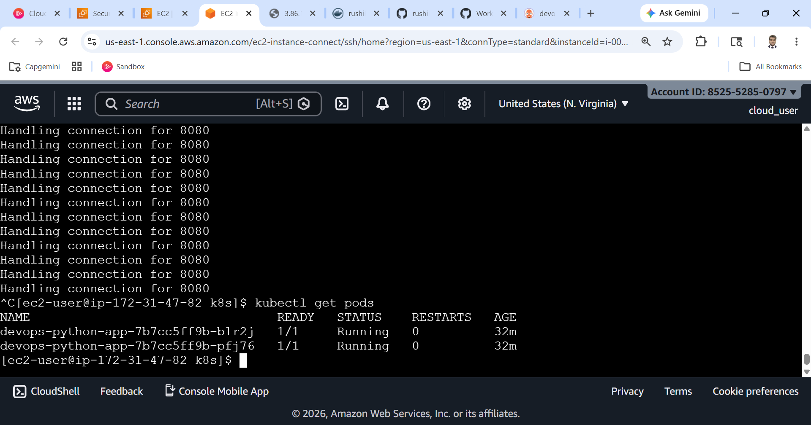
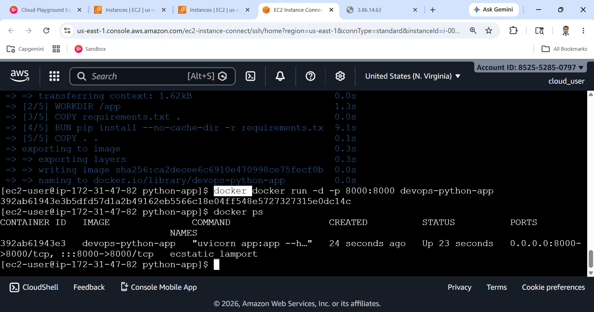
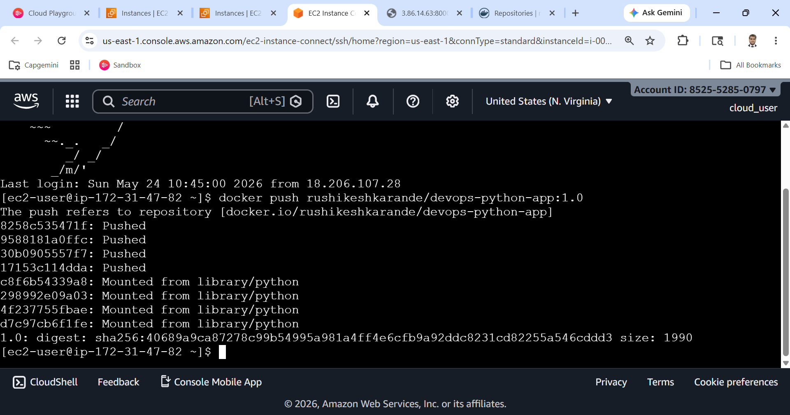
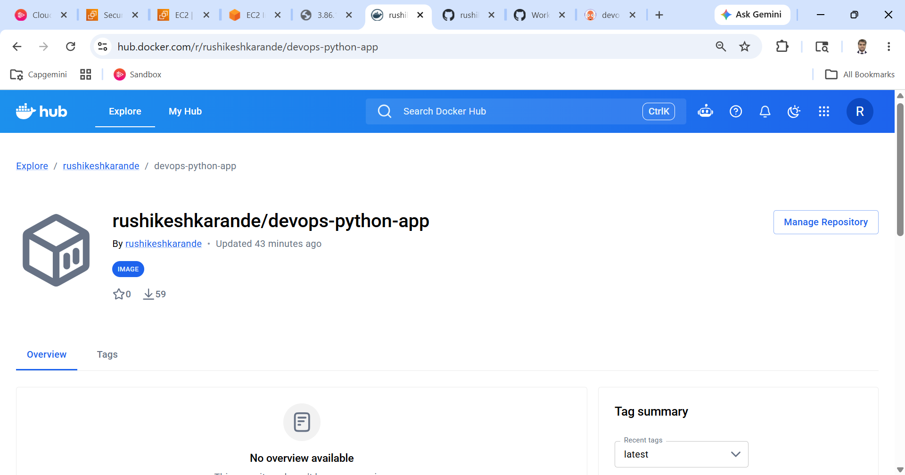
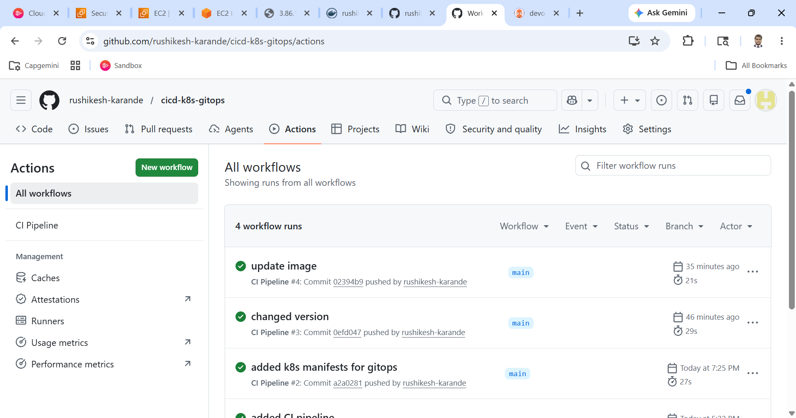
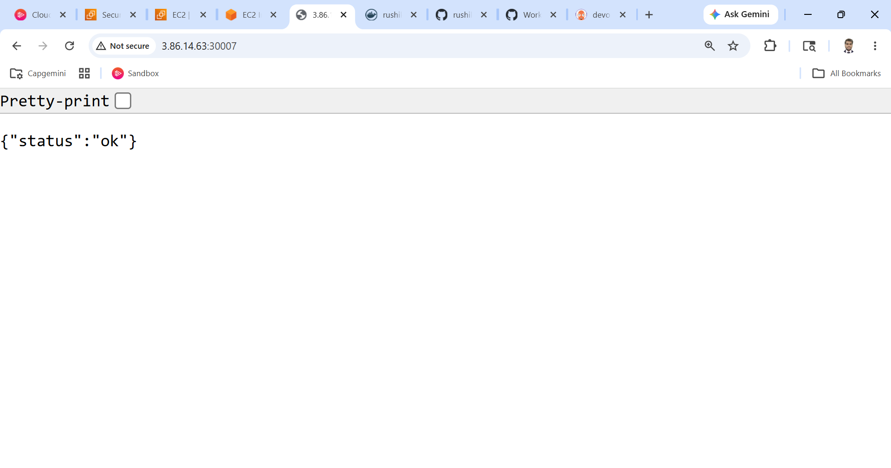
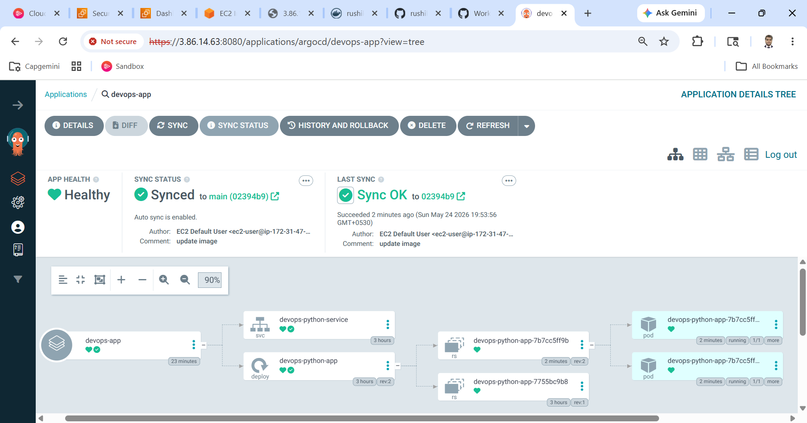

# DevOps CI/CD Pipeline with Kubernetes & GitOps

This project is a hands-on implementation of a real-world DevOps workflow.
It covers the complete journey from code to deployment using Docker, Kubernetes, CI/CD, and GitOps.

---

## 🚀 Project Overview

This project demonstrates:

- Building a Python API service
- Containerizing using Docker
- Automating build & push using GitHub Actions
- Deploying to Kubernetes (k3s on EC2)
- Managing deployments using ArgoCD (GitOps)

---

## 🧠 Architecture

Developer → GitHub → CI Pipeline → Docker Hub → ArgoCD → Kubernetes (EC2)

---

## ⚙️ Tech Stack

- AWS EC2
- Docker
- Kubernetes (k3s)
- GitHub Actions
- ArgoCD
- Python (FastAPI)

---

## 📁 Project Structure

```
.
├── app.py
├── Dockerfile
├── requirements.txt
├── k8s/
│   ├── deployment.yaml
│   └── service.yaml
├── .github/workflows/
│   └── ci-cd.yml
└── screenshots/
```

---

## 🐍 Application

Simple FastAPI service with endpoints:

- `/` → health check  
- `/hello` → test endpoint  
- `/version` → app version  

---

## 🐳 Docker

- Built Docker image using `python:3.9-slim`
- Exposed application on port 8000
- Pushed image to Docker Hub

---

## 🔄 CI Pipeline (GitHub Actions)

On every push to `main`:

- Checkout code
- Build Docker image
- Push to Docker Hub

---

## ☸️ Kubernetes Deployment

- Deployment with 2 replicas
- NodePort service


---

## 🔁 GitOps with ArgoCD

- ArgoCD watches the `k8s/` folder
- Automatically syncs with cluster
- No manual `kubectl apply` needed

---

## 📸 Screenshots

### 1. EC2 Instance


---

### 2. Kubernetes Nodes


---

### 3. Running Pods


---

### 4. Docker Build


---

### 5. Docker Push


---

### 6. Docker Hub Repo


---

### 7. GitHub Actions Pipeline


---

### 8. Application Running


---

### 9. ArgoCD Dashboard


---

## ✅ Key Learnings

- End-to-end CI/CD pipeline
- Containerization using Docker
- Kubernetes deployment and service exposure
- GitHub Actions automation
- GitOps workflow using ArgoCD
- Debugging real-world issues

---

## 👨‍💻 Author

Rushikesh Karande
